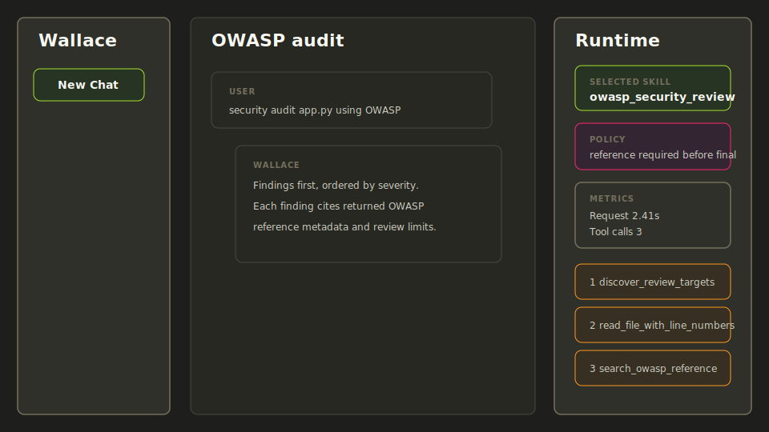
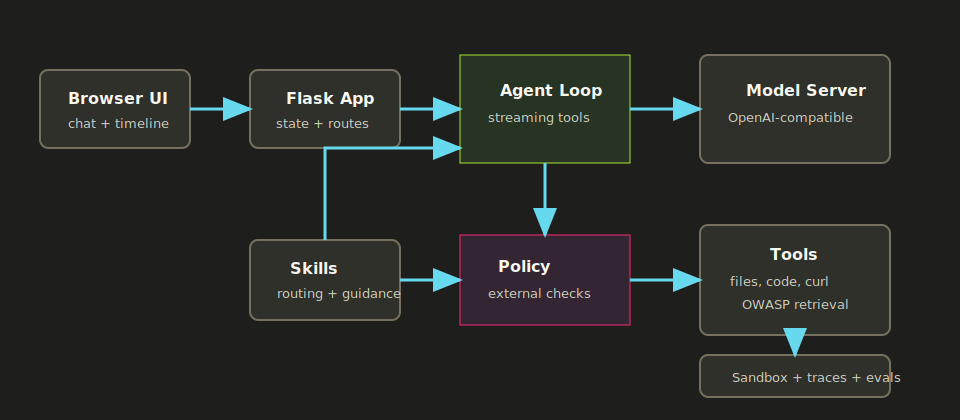

# Wallace

[](https://github.com/clementdmsn/wallace-agent-runtime/actions/workflows/quality.yml)


Wallace is a local-first AI agent runtime for security-aware developer
workflows. It combines streamed OpenAI-compatible tool calling, sandboxed local
execution, runtime skill routing, external policy enforcement, inspectable
observability, and deterministic offline agent evals.

Most agent demos optimize for a smooth conversation. Wallace optimizes for what
happens after the demo: runtime control, bounded context, inspectable tool use,
and repeatable behavior contracts.

The core premise is simple: the model can propose work, but the runtime should
control what can happen. Wallace selects skills before the model answers,
injects task-specific procedures into a temporary request prompt, validates tool
calls against active policy, tracks context pressure explicitly, and checks
critical behaviors with deterministic offline evals.



## Trace-Driven Demo

Wallace demos are presented as deterministic traces and eval contracts rather
than live recordings. The primary scenario is an OWASP-assisted audit:

```text
security audit app.py using OWASP
```

Representative trace excerpt:

```json
{
  "selected_skill": "owasp_security_review",
  "policy": "requires search_owasp_reference before final answer",
  "tool_calls": [
    "discover_review_targets",
    "read_file_with_line_numbers",
    "search_owasp_reference"
  ],
  "eval": "owasp_review_requires_reference_search_before_final: pass"
}
```

See the full guided walkthrough in
[`docs/demo/owasp-audit.md`](docs/demo/owasp-audit.md), the sample trace in
[`docs/examples/owasp-trace.json`](docs/examples/owasp-trace.json), the sample
report in [`docs/examples/owasp-report.md`](docs/examples/owasp-report.md), and
the stored offline eval output in
[`docs/examples/offline-eval-report.json`](docs/examples/offline-eval-report.json).

## Why This Project Exists

Most agent frameworks make it easy to show an impressive first answer. The
harder problem is keeping an agent understandable after it starts using tools,
accumulating context, and producing decisions that need to be reviewed.

Wallace focuses on that engineering layer around the model:

- choosing the right workflow before the model answers;
- constraining tool use with runtime policy;
- treating context as a runtime budget, not an unlimited transcript;
- separating source code from runtime workspace state;
- making tool calls, prompt size, compaction, and traces visible;
- turning agent behavior into repeatable offline eval contracts.

The main guided demo is an OWASP-assisted static security audit where Wallace
must retrieve OWASP references before producing final findings.

## What Wallace Demonstrates

- **Agent runtime:** streamed model loop, tool-call reconstruction, hidden tool
  messages, retries, and run lifecycle state.
- **Context management:** request-scoped prompt injection, hidden tool messages,
  prompt-size estimates, context-reference compaction, saved-character metrics,
  and trace events when compaction is applied.
- **Tooling:** explicit OpenAI function schemas for file, shell, code
  inspection, curl, skill, and OWASP reference tools.
- **Safety controls:** sandbox path validation, shell restrictions, curl domain
  approval, direct skill-file write protection, and policy checks outside the
  model.
- **Skill routing:** pre-model selection of task-specific procedures with
  guidance and active tool policy.
- **Observability:** runtime timeline, tool-call events, request timing,
  prompt estimates, context-compaction estimates, and optional JSONL traces.
- **Evaluation:** deterministic offline evals for skill selection, ordered tool
  calls, blocked premature answers, hallucination guards, and unsafe access
  attempts.

## Architecture



- `web/` serves the Flask app and browser UI.
- `agent/` owns the model loop, streaming, tool execution, metrics, traces, and
  active skill policy.
- `tools/` contains registered tool implementations and OpenAI tool schemas.
- `skills/` loads, selects, scores, and turns active skills into execution
  guidance.
- `skill_catalog/` contains versioned active skill metadata and procedures.
- `evals/` contains deterministic offline agent contract scenarios.
- `sandbox/` is runtime-owned state and is ignored.

See [`docs/architecture.md`](docs/architecture.md) and
[`docs/design-decisions.md`](docs/design-decisions.md) for more detail.

## Guided Demo

The primary showcase scenario is an OWASP-assisted audit:

```text
security audit app.py using OWASP
```

Expected behavior:

1. Wallace selects `owasp_security_review`.
2. The selected skill activates a bounded defensive review procedure.
3. Runtime policy requires target discovery before inspection.
4. Final audit answers are blocked until `search_owasp_reference` has run.
5. The final report cites returned OWASP reference metadata and states review
   limits.

Demo materials:

- [`docs/demo/owasp-audit.md`](docs/demo/owasp-audit.md)
- [`docs/examples/owasp-trace.json`](docs/examples/owasp-trace.json)
- [`docs/examples/owasp-report.md`](docs/examples/owasp-report.md)
- [`docs/examples/offline-eval-report.json`](docs/examples/offline-eval-report.json)
- [`docs/assets/demo-01-prompt.svg`](docs/assets/demo-01-prompt.svg)
- [`docs/assets/demo-02-tool-timeline.svg`](docs/assets/demo-02-tool-timeline.svg)
- [`docs/assets/demo-03-policy.svg`](docs/assets/demo-03-policy.svg)
- [`docs/assets/demo-04-evals.svg`](docs/assets/demo-04-evals.svg)
- [`docs/showcase.md`](docs/showcase.md)

## Quick Start

Start an OpenAI-compatible local model server first. By default Wallace expects:

```bash
http://localhost:1234/v1
```

Copy the public environment template if you want local overrides:

```bash
cp .env.example .env
```

Run with Docker Compose:

```bash
docker compose up --build
```

Open:

```bash
http://127.0.0.1:8000
```

Stop the container:

```bash
docker compose down
```

Reset Docker sandbox and private state:

```bash
docker compose down -v
```

## Host Development

Install runtime dependencies:

```bash
make install
```

Install development dependencies:

```bash
make install-dev
```

Run locally:

```bash
make run
```

Run the full quality gate:

```bash
make quality
```

## Configuration

Runtime settings are read from environment variables in `config.py`. Common
variables:

- `WALLACE_MODEL_PROVIDER`: provider preset, currently `local`.
- `WALLACE_BASE_URL`: OpenAI-compatible API base URL.
- `WALLACE_API_KEY`: API key sent to the model server.
- `WALLACE_MODEL`: chat model name.
- `WALLACE_EMBEDDING_MODEL`: embedding model name.
- `WALLACE_HOST` / `WALLACE_PORT`: Flask bind settings.
- `WALLACE_PROJECT_DIR`: project-owned source directory.
- `WALLACE_SANDBOX_DIR`: runtime-owned workspace for files, logs, drafts, and
  generated indexes.
- `WALLACE_CURL_WHITELIST_PATH`: private curl approval whitelist path.
- `WALLACE_RUN_TRACE`: enable JSONL run traces.
- `WALLACE_RUN_TRACE_PAYLOADS`: include redacted payloads in traces.

See [`.env.example`](.env.example) for the full template.

## Offline Agent Evals

Wallace includes deterministic offline agent contract evals. They do not call a
model server or embedding backend; they exercise the same skill-selection,
execution-guidance, and active policy code paths used by the runtime.

Run the default suite:

```bash
make eval-offline
```

Emit JSON for CI/reporting:

```bash
python -m evals.offline_runner --json
```

Stored sample output:

[`docs/examples/offline-eval-report.json`](docs/examples/offline-eval-report.json)

Current eval matrix:

| Scenario | Contract |
|---|---|
| `owasp_review_requires_reference_search_before_final` | OWASP final answers are blocked before retrieval. |
| `owasp_review_allows_final_after_reference_search` | OWASP final answers are allowed after retrieval. |
| `owasp_review_blocks_wrong_tool_before_discovery` | The selected skill enforces ordered tool calls. |
| `owasp_review_blocks_path_escape_target` | Path escape attempts are blocked through policy fixtures. |
| `owasp_review_blocks_hallucinated_reference_answer` | Unsupported OWASP claims are blocked before retrieval. |
| `whole_file_code_overview_uses_summary_tool` | Whole-file explanation uses summary tooling, not raw reads. |
| `function_explanation_requires_symbol_discovery` | Function explanation requires symbol discovery first. |
| `function_explanation_blocks_unrequested_symbol` | The model cannot substitute a guessed symbol. |
| `skill_authoring_blocks_direct_active_skill_writes` | Active skill files must be written through skill tools. |
| `general_question_does_not_activate_skill_policy` | General questions do not over-select task policy. |

## Security Posture

Wallace is local-first and defensive. It includes sandbox path validation, shell
command restrictions, curl approval, runtime tool policy, and trace redaction.
It is not a hardened multi-user service.

Read [`SECURITY.md`](SECURITY.md) before exposing Wallace beyond a trusted local
machine.

## Limitations

- one in-memory agent;
- no authentication;
- no durable multi-session persistence;
- no production trace storage backend;
- no hosted deployment profile;
- application-level sandboxing unless combined with Docker or stronger host
  isolation;
- local model quality depends on the configured model server.

## Project Docs

- [`docs/showcase.md`](docs/showcase.md): technical system walkthrough.
- [`docs/architecture.md`](docs/architecture.md): active runtime architecture.
- [`docs/design-decisions.md`](docs/design-decisions.md): engineering tradeoffs.
- [`SECURITY.md`](SECURITY.md): threat model and real security boundary.
- [`docs/applications.md`](docs/applications.md): technical application patterns.
- [`ROADMAP.md`](ROADMAP.md): next steps and production hardening.

## Status

Wallace is a local-first reference implementation for inspectable,
policy-governed agent systems. The current emphasis is agent runtime design,
safety-aware tooling, observability, and deterministic agent behavior contracts.
